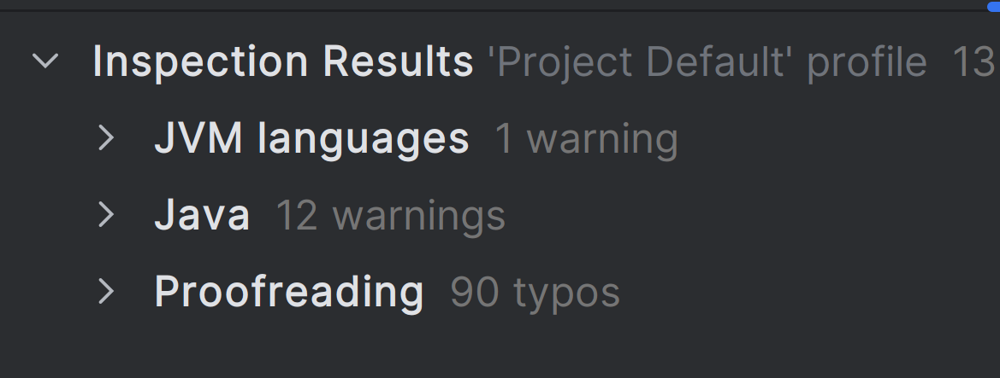

Case study project for job application as software architect at Solvia Digital Solutions, Istanbul (www.solviads.com). 08/07/2024

It is a basic e-commerce api. Can be tested on Postman or any rest client.

Post at `/createUser` with `email, password, role` to create a user. Creation with admin role is allowed for demo purposes. (`role="ADMIN"`)

Post at `/token` with your email as username and password to get a JWT token.

Use the token for the next requests:

Post at `/products` with `name, description, price, isOnSale` to create some products.

Post at `/basketItems` with `user, product quantity` to add products to basket. `product` and `user` should be urls to product being purchased and the user making the purchase. Api does not automatically assign the current user so the client has to pass in a user.

Post at `/makePayment` with `user, cardNumber, expiryDate, cvv` to create the order. Card number must be `12345` for the payment to go through. Basket total will be calculated, an order will be created and the basket will be emptied. Newly created order will return in the response.
   
Admin can do regular user operations like adding to own basket, making payment, creating order... This for ease of testing, so we don't have to switch between users often. Also can be the wanted behaviour.

Regular users cannot create or delete products, to demonstrate and test the role implementation.

Users and admins can add to each others baskets, make orders for each other. Users can basically mimic each other. This is for demo purposes, but can also be a wanted feature. Otherwise, principal's id can be checked in `@PreAuthorize` annotations. Current user id can be assigned programmatically inside repository event handlers.

All endpoints allow all http methods so one can manage users, baskets, orders, and products. Post at `/order` is not allowed so one needs to go through `/makePayment`. And `/createUser`, `/token` and `/makePayment` are post only.

`/products` endpoint has QueryDSL integrated so it can run searches and filters combined like `/products?name=easy&isOnSale=true`. Finds products with name containing "easy" and with discount. It is missing min max filter and some other things maybe, but it is relatively easy to improve and can be effortlessly reused at any endpoint.

One million records can be searched in around one second. 2.5 million products take 3.2 seconds to search. Tested on a fast computer with a simple query, one text contains search and one boolean filter combined.

As the crud operations, paging, sorting, search and filtering are framework features they don't need unit testing.
Repository implementations and controllers are generated by Spring Data Rest, One only needs to write the repository interfaces. So no unit testing needed for those either.
Most entity constructors, getters and setters are auto generated by the Lombok library.
That is a lot of unit tests we don't have to write. Not only the auto generated code itself.

I added some integration tests, mostly around security, product management and search, and payment and order creation. And a test to test product search speed with big data. That is around 50% code coverage. Supposed to be at least 90%, but I have to leave here considering I have only 4 days for the project. 

IntelliJ code inspection finds the empty method from the default empty spring test, some unused fields I've used for demo purposes, like expiry date of credit card etc... And gives one false alarm that a repository interface method is not implemented where the implementation is auto generated by Spring Data Rest and all works ok. Everything relevant has been fixed.

Qodana finds no problems. 

Project is restful architecture, uses Spring Data Rest (SDR) for standard operations, makes use of custom controllers, custom repository interface methods or repository event handlers where there needs to run custom logic.

Spring Data Rest allows to generate endpoints directly from entities. Once served by these endpoints, entities automatically become rest resources, with url links (not just ids!) to each other where there is a relationship.

And check out this standard localized multi-language validation error message.

With a compatible client which has convenient ways to follow, retrieve and combine results from these relationship links, it becomes like GraphQL. Only more restful, with more meaningful error messages, separated endpoints, stricter typed data and more convenience to organize and navigate or cache if needed. And most of the server side is autogenerated. Less prone to human error, much more functional, standard and stable.

Project module structure is divided into three modules at top. Each module being one layer from Eric Evans' DDD book. Presentation layer being left out as it is mostly json generated by framework. No microservices, no event bus.

`model` is the business domain layer. Contains entities and repository interfaces.
`application` is the application layer. Contains custom controllers to create user, make payment..., the `UserDetailService`, spring configuration like excluding user registration from web security, improving standard error messages, jwt configuration, removing standard role prefixes...
`infrastructure` contains the mock-up payment service.